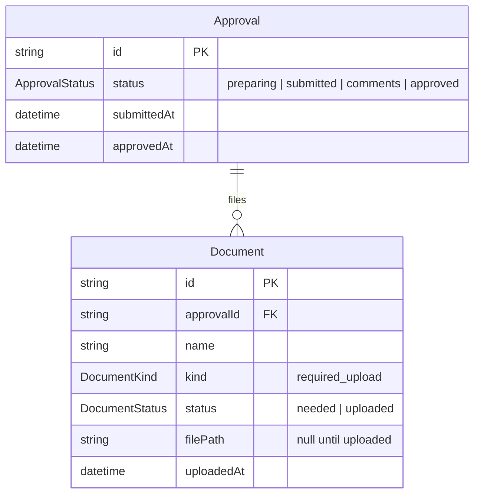
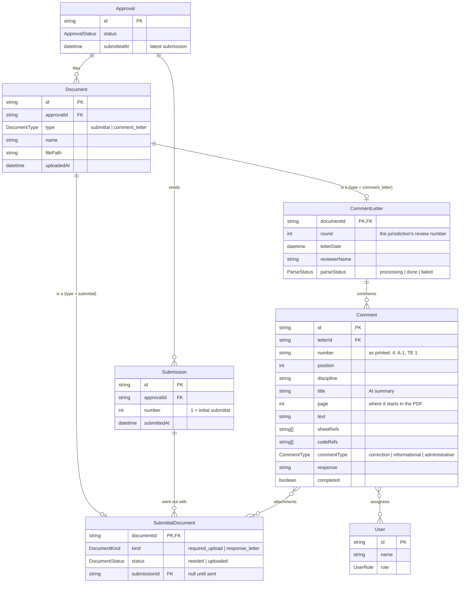
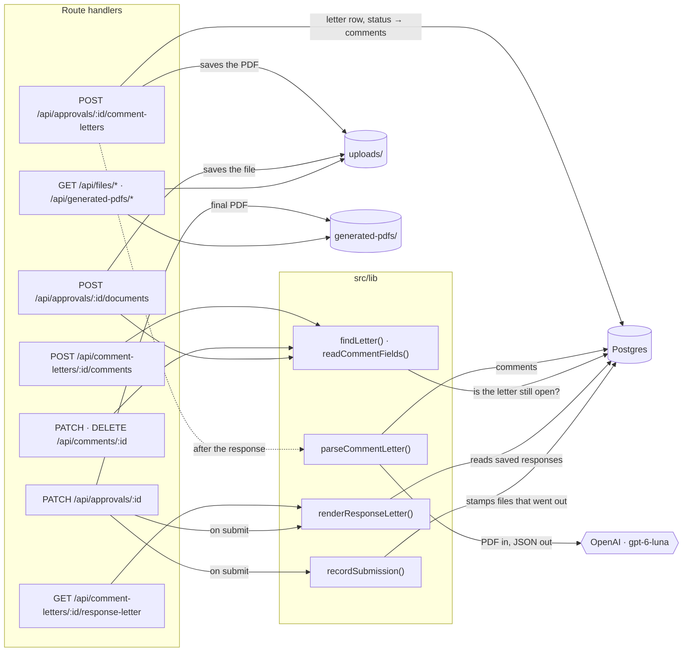

# Updated Document Schema

## Original

Every file on an approval was one `Document` row. It was only ever a checklist item for the submission package: a name, a `needed` / `uploaded` status, and the stored file.

## New

`Document` keeps only what every file has, and `type` says which subtype table holds the rest (class table inheritance). A subtype's primary key is the document's id.

- **SubmittalDocument**: a file the team sends (checklist items, files attached to responses, the generated response letter), and the submission it went out with.
- **CommentLetter**: the jurisdiction's letter, its review round and what parsing found.
- **Comment**: one item from a letter, as printed, plus the team's response, assignees and attached files.
- **Submission**: one package sent to the jurisdiction. Submission 1 is the initial submittal. The comment letter from review N is answered by submission N + 1.

What moved: `kind` and `status` went from `Document` to `SubmittalDocument`, since they mean nothing for a comment letter. `Approval` gained `submissions`, and `User` gained the comments assigned to them.

# Endpoints

| Endpoint | What it does | Reads / writes | Calls |
|---|---|---|---|
| `POST /api/approvals/:id/comment-letters` | Uploads the jurisdiction's letter and moves the approval to `comments`. Responds right away; parsing runs after. | Writes `Document` + `CommentLetter` (round = latest submission), `Approval.status`; the PDF to `uploads/` | `saveUpload()`, then `parseCommentLetter()` in `after()` → OpenAI → `Comment` rows |
| `PATCH /api/approvals/:id` | Changes status. On "Submit to jurisdiction": holds back unanswered corrections (409 until confirmed), stores the final response letter, records the submission. | `Approval`, `Comment` (unanswered count), `Submission`, `SubmittalDocument`; the PDF to `generated-pdfs/` | `renderResponseLetter()`, `saveGeneratedPdf()`, `recordSubmission()` |
| `POST /api/comment-letters/:id/comments` | Adds a comment the parser missed. | Writes `Comment` (next position) | `findLetter()`, `readCommentFields()`, `areProjectMembers()` |
| `PATCH /api/comments/:id` | Edits a comment: its text and fields, response, completed, assignees, attached files. | `Comment`, assignee and attachment links | `findLetter()`, `readCommentFields()`, `areProjectMembers()` |
| `DELETE /api/comments/:id` | Deletes a comment. | `Comment` | `findLetter()` |
| `POST /api/approvals/:id/documents` | Uploads a new file and optionally attaches it to a comment ("Upload new file"). | Writes `Document` + `SubmittalDocument`; the file to `uploads/` | `saveUpload()`, `findLetter()` |
| `POST /api/documents/:id/upload` | Fills a checklist item before the first submission (existing route, now writes status on the subtype). | `Document`, `SubmittalDocument.status` | `saveUpload()` |
| `GET /api/comment-letters/:id/response-letter` | Downloads the response letter as it stands. Generated fresh each time, marked draft while editable, never stored. | Reads the letter, comments, responses, attachments | `renderResponseLetter()` |
| `GET /api/files/*` | Serves uploaded files. | `uploads/` | `serveFile()` |
| `GET /api/generated-pdfs/*` | Serves submitted response letters. | `generated-pdfs/` | `serveFile()` |

Comments can only change while their letter is the latest one and the approval is in `comments`; `findLetter()` enforces this for every comment route. Pages (`/approvals/:id`, `/letters/:id`) read Postgres directly as server components, so there are no GET endpoints for data.

# UI Design

<!-- Screenshot of the design and notes on the UI choices go here. -->

# Challenges

- **Modeling files vs. comment letters.** A letter is a file like any other, but carries its own data (round, date, reviewer, parse status) and owns comments. Class table inheritance kept one `Document` table without letter-only columns on every checklist item.
- **Messy letters.** The six samples range from clean numbered lists to tables, a 40-comment multi-discipline report, and a fax scan with handwriting. Strict JSON-schema output keeps every parse the same shape; gpt-6-luna was within a point of Sol on extraction benchmarks at a twentieth of the price.
- **Not losing the team's work.** Re-parsing would replace comments that already have responses, so a letter is parsed once and fixed by hand (add, edit, delete) instead.
- **Getting review cycles right.** Jurisdictions number reviews from their first look at the initial submittal ("1st Review", "Review No. 2 of 3"). The page groups each letter with the resubmittal that answers it so numbers match the letters.
- **An honest response letter.** It's rendered on the server from saved data, drafts are labeled and never stored, and the copy that goes out is stored with its submission.
- **Pointing at a comment in the PDF.** Chrome's viewer can jump to a page but not highlight text, so the letter viewer searches the PDF's text for the comment and falls back to the parsed page for scans.

# Expansions

- OCR for scanned letters, so fax-style PDFs can be searched and highlighted too.
- One response letter per reviewer for multi-discipline reports (e.g. Ridgeline's 15 reviewers).
- AI-drafted responses the team reviews and edits.
- Linking repeat comments ("carried forward from Update 0") to the previous cycle's response.
- Deployment: blob storage for `uploads/` and `generated-pdfs/`, a hosted Postgres, and auth.
