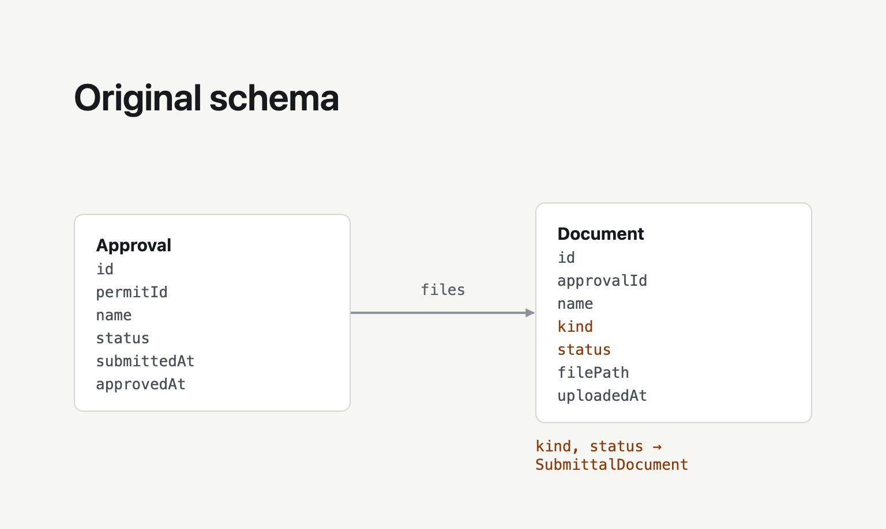
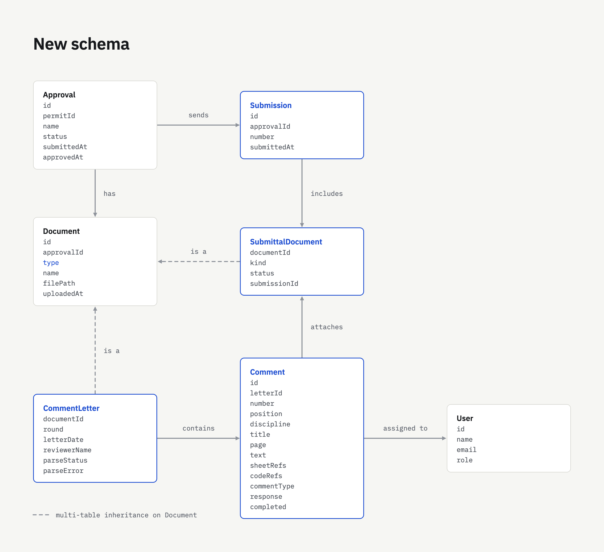
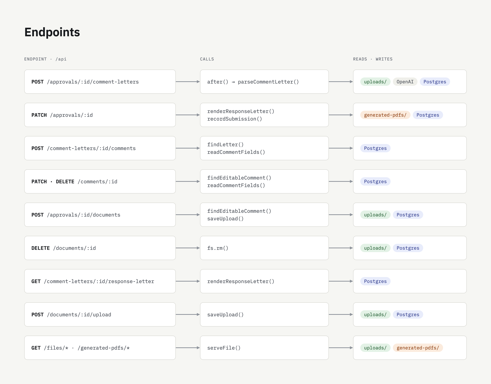
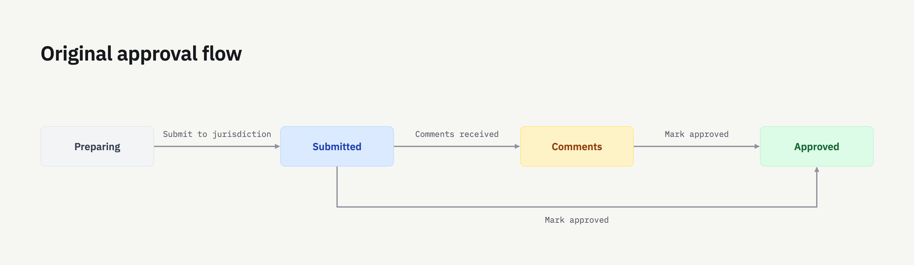
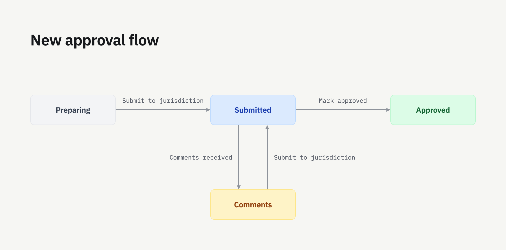
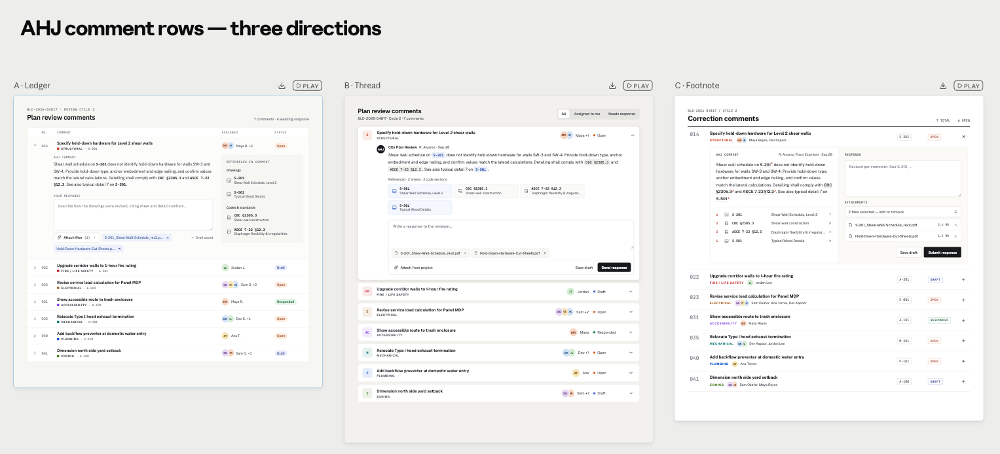

# Pulley Take-Home Assignment

A simplified permit tracking app. Projects contain permits, permits contain approvals, and each approval moves through a review lifecycle with the **jurisdiction**, the city or county that issues the permit.

Your assignment is described in [ASSIGNMENT_TAKEHOME.md](./ASSIGNMENT_TAKEHOME.md). Follow the setup instructions below to get the app running.

## Stack

- [Next.js](https://nextjs.org/) (App Router) for both frontend and backend
- [Prisma](https://www.prisma.io/) + PostgreSQL. Postgres runs embedded via [`embedded-postgres`](https://www.npmjs.com/package/embedded-postgres), so there is nothing to install or run separately (no Docker). Data lives in `.pgdata/`.
- Tailwind CSS
- Uploaded files are stored on local disk in `uploads/` and served via `/api/files/*`; submitted response letters are stored in `generated-pdfs/` and served via `/api/generated-pdfs/*`

## Setup

Requirements: Node 22+ (see `.nvmrc`). That's it.

Extract the ZIP file you received by email, open a terminal in the extracted project folder, and run:

```bash
cp .env.example .env    # add your own API key(s) for AI features
npm install
npm run setup           # runs migrations and seeds data
npm run dev             # starts Postgres + Next.js
```

Open http://localhost:3000.

We encourage you to build AI features. Supply your own API key(s) in `.env`; keys are not included.

`npm run dev` starts the embedded Postgres and the Next.js dev server together. If you want to run something else against the database (e.g. `psql`, Prisma Studio), `npm run db` keeps Postgres up on port 5433 by itself, or use `npm run db:migrate` / `npm run db:seed` which wrap the corresponding Prisma commands.

If you ever want a clean slate: `npm run db:reset` (re-runs migrations and the seed).

## Domain primer

- **Project**: a construction project at an address, permitted by a jurisdiction. Each project has a team (`ProjectMember`s).
- **Permit**: a permit being pursued for the project (e.g. Building Permit, Health Permit).
- **Approval**: an individual review a permit needs. Each approval has a status:
  - `preparing`, assembling required documents before submitting
  - `submitted`, the jurisdiction is reviewing
  - `comments`, the jurisdiction responded with review comments (a "comment letter") that must be addressed
  - `approved`, done
- **Document**: a file attached to an approval. Today this is only the required-upload checklist used while preparing.

Approvals move between statuses using the action buttons on the approval page (`PATCH /api/approvals/:id`): submit to the jurisdiction, record that comments came back, or mark it approved. The UI only offers forward moves, but the API itself is intentionally simplistic and will accept any status change, with no rules about what a valid transition is.

There is no auth. The app assumes a single logged-in PM (Ana Reyes).

## Useful things in the repo

- `prisma/schema.prisma`, the data model
- `prisma/seed.ts`, seed data (3 projects with approvals in every status)
- `src/lib/storage.ts` and `src/app/api/files/[...path]/route.ts`, how file upload and serving already work (see the `preparing` document checklist for a working example)
- `sample-letters/`, the comment letters to build against

# Technical Changes

This section gives a high-level overview of the technical design decisions made.

Take a look at a Loom walkthrough of the app [here](https://www.loom.com/share/678127b9733546f1b663c9124e81e81d).

To run it yourself, add an OpenAI API key to `.env`

## Prisma

### Original Schema

The original schema is built with only two things in mind: approvals and documents associated with approvals.
It is visually depicted in the image below:



### Updated Schema

In order to facilitate comments, we must first take in the pdf comment letter document. This means we now have two types of documents, with some overlap.

All documents are associated with an approval, have a name, have a filepath, and have a time they were uploaded.

However, `kind` (with type `required_upload`) and `status` (with types `needed` or `uploaded`) don't apply to comment letter documents, as they are provided by the reviewers, not something that need to be created or collected by the planners.

Additionally, comment letter documents have some fields that the original document wouldn't need, e.g. `parseStatus`, `round`, etc.

For this reason, I created two new models, `SubmittalDocument` and `CommentLetter` to differentiate between the two types of documents. Additionally, model `Comment` was also created to keep track of all the fields parsed from the document by AI. `Comment` is separate from `CommentLetter` because one `CommentLetter` may contain many `Comment`s.

In addition to this, since in a regular process planners may submit multiple rounds/cycles of applications in response to comments, we now need to keep track of submissions separately to distinguish each package sent for review.

The diagram below summarizes this:



## Backend Changes

### API Endpoints

In order to facilitate this new schema, there are plenty of new endpoints that needed to be created in order to connect this to the frontend.

The diagram below outlines the endpoint, which functions that endpoint calls, and where data is manipulated by those functions.



### AI Integration

A large part of this project depends on AI parsing the comment letters to extract relevant information. This is accomplished using GPT-6 Luna, for its high effectiveness in document parsing and low cost per query.

| Model | OCR | Data extraction | Avg. cost / sample | Price per 1M tokens (in / out) |
|---|---|---|---|---|
| **GPT-6 Luna (used)** | 90.6% | 83.5% | $0.0004 | $0.10 / $0.50 |
| GPT-6 Sol | 91.7% | 84.2% | $0.0065 | $2 / $10 |
| GPT-6 Astra | 91.9% | 88.7% | $0.030 | $10 / $50 |

Scores are from [Roboflow Vision Evals](https://playground.roboflow.com/models/openai/gpt-6-luna) at low reasoning effort. Prices are OpenAI's standard rates via [Requesty](https://www.requesty.ai/blog/gpt-6-sol-luna-pricing-release-api).

As you can see from this table, Sol and Astra are only slightly better at the relevant tasks for a far larger price point.

This is accomplished by sending an API call to OpenAI with a system prompt outlined in `src/lib/parse-comment-letter.ts` with the PDF comments letter attached.

The result is a JSON object in the form described that matches up with the Prisma model for `Comment`.

An interesting note here is that Luna can parse both images and pdfs.

Additionally, during the parsing the model is asked to extract a `title`, a short summary of what the comment is asking for, used as the title in the comments list in the UI.

### Response PDF Generation

The outline of the take-home assignment left what a response actually looks like fairly vague, but the sample letters seemed to indicate that a response is a PDF letter answering each comment, sent back along with the updated relevant files.

The response letter is compiled from the comments provided by the AHJ, the responses written in each drop-down, and a template that can be found in `src/lib/response-letter.tsx`.

On the frontend, a user can request to download a partially-complete version of the PDF response. This is generated on the server and sent to the client for download without saving it on the server. The response PDF is only submitted on an official submission. This is done primarily because it's unnecessary to save a partially completed response PDF.

## Frontend

The UI was planned out from a functional perspective, with what the user needs in mind.

### Review Cycles

Firstly, the usage flow was reimagined to support multiple rounds/cycles of review from the AHJ.





When comments come back, the team answers them and resubmits, which sends the approval back to Submitted. Each round of comments and the resubmittal that answers it is one review cycle, and cycles repeat until the AHJ approves.

This is why the approval page now includes headings in reverse chronological order for each review cycle, as well as the initial submittal.

Each section contains two parts: The documents submitted / to be submitted, and the list of comments along with relevant info associated with them.

### Comments

Comments are the most integral part of this software, so figuring out how to neatly display what is necessary was key.

Since one submission to the AHJ can come with plenty of comments, a planner would want to see all of them holistically, and then dive into specific comments to retrieve more information.

This practical use-case drove the idea of making each individual comment vertically short to pack as many as possible on the screen at once, to make it as easy as possible to skim through. Only the most relevant information is visible: a summary of what the comment is asking, the comment number in the original letter, which discipline it's related to, who it's assigned to, and what stage of completion it's in.

Each comment is a dropdown to reveal more information about the comment if a user wants to take a look. Here they can read the full original comment, write their response, attach files to their response, easily see which drawings & codes are referenced in the comment, as well as edit the comment if parsing went wrong. These are all important, but do not need to be accessible at a glance, and are thus hidden behind a dropdown.

I used Claude Design to come up with three potential ways to organize this information:



I decided to go with option A, and made some minor tweaks to align it with the best possible user experience.

### Documents to Submit

The documents to submit section appears just above the comments list in the UI, so that it is easy to review which files are going to be submitted to the AHJ and review/update those.

The generated response letter is separated just above the rest of the files, because from a user perspective, the supplementary files might be edited and written in a different place, like Rhino, AutoCAD, or MS Word, so they are not of top priority when on the Pulley app. However, the responses to the comments are the express purpose of this part of the Pulley app, and most likely what a user is looking to check on, so it is separated on top and easy to access.

Additionally, this project came with a "What we submitted" section for files associated with the submission. This section has now been split up across review cycles, so each review cycle can have its own files for submission.

### Bonus Feature: Highlighted PDF Reader

The key selling point of this Pulley app is its AI parsing of comment letters, making it easy to organize and delegate responses.

Understanding that the client is likely a non-technical real-estate developer/planner, one of their key worries with implementing AI features is reliability. To the general public, AI is closely associated with productivity and speed, but is also associated with hallucination and unreliability.

In order to stave off such skepticism, and to pre-emptively answer the question "how do you ensure reliability", I've implemented a link under each comment that opens the original PDF letter with comments, and jumps straight to (and highlights) the comment in question. This way the user can quickly verify that the parsed results match the original.

Technically, this is implemented by taking the parsed comment and loosely searching for it in the document. In the case that it was incorrectly parsed and fails to find the comment, the parser pre-emptively saves which page the comment was taken from, so the PDF viewer jumps to that page.

Implementing this required creating a custom PDF viewer, since the built in PDF reader does not support text highlighting.

# Additional Notes

## Assumptions

1) A standard response template works across any AHJ.
2) The expectation was to only implement comment-related features (meaning no login/auth, automatically sending submissions somewhere, etc.)
3) Each review cycle needs only one response letter.
4) GPT-6 Luna is powerful enough to accurately parse most comment letters.
5) Letters have a text layer that is parseable (as in I don't need to implement OCR) for the jump-to-text feature.

## Challenges

1) Deciding if I should reuse/modify the Document model to make it work for comment letters, or go with class table inheritance where Document is a supertype holding information about every file, and SubmittalDocument and CommentLetter are subtypes. The challenge here is balancing scalability with simplicity.
2) Deciding which fields to put in Comment and CommentLetter models. This involved a dual approach of manually analysing the sample letters for patterns and employing Claude to do the same. I needed to decide which general categories of things repeated across all sample letters, and which were unique or one-off, while keeping in mind what would be relevant for a user to see on a dashboard.
3) Including support for re-parsing a document. Since parsing a file is non-deterministic, it may fail, and a user may want to retry. However by re-parsing, it would also regenerate all comments and necessarily delete any half-written responses. The alternative would be saving responses and then writing an engine to map responses to old comments to the new comments. In order to preserve simplicity, the option for re-parsing was not implemented, and instead the user has the capability to manually edit any parsed comment, delete comments, and add new comments that may have been missed by the parser.
4) Whether or not to include drawing and code standards as a separate section under the comment. I decided to do so because a user may want to quickly check on a comment and find the document (e.g. building code) that would contain the solution to the comment. This only slightly complicates the system for what I perceived to be a fairly useful addition.

## Potential Expansions

1) Make drawing and code standards link directly to the files they are referencing so a planner can easily access them without searching.
2) Written responses capable of taking more than just plaintext (e.g. bullet points, bolding, etc.)
3) Ability to undo stage changes (e.g. submit to jurisdiction)
4) Ability to create new projects and add new permits (currently can only work with seed)
5) Login for multiple users
6) OCR for scanned comment letters.
7) AI assistant for responding to comments. (Or Claude/GPT integration via MCP)
8) Automatically submit response and associated files to AHJ (either email or in some portal)
9) Main dashboard with more insights (maybe some graphs) on the state of various projects/permits.

## Personal Thoughts

As a software developer, understanding the product, and how the end user intends to use the software, is one of the most important aspects of good software design.

This project, being so closely tied to the day-to-day work of a planner, involves a strong understanding of what a planner needs and uses, as well as what a reviewer may return in their comments.

Given that I am a software developer with no experience with these fields, I had to make progress based off of my own interpretation of what someone in these roles may be looking for.

Given the context of this project, being a take-home technical, I think that's okay. But on the job, working on real projects, it would be extremely important for me, as a software developer, to talk to and understand how a user would use this software.

This is a quality that I am unable to express in this take-home, but something that I believe to be just as important as technical capability (and something I would prioritize as an intern at Pulley), so I am noting this down here for anyone who may read it.